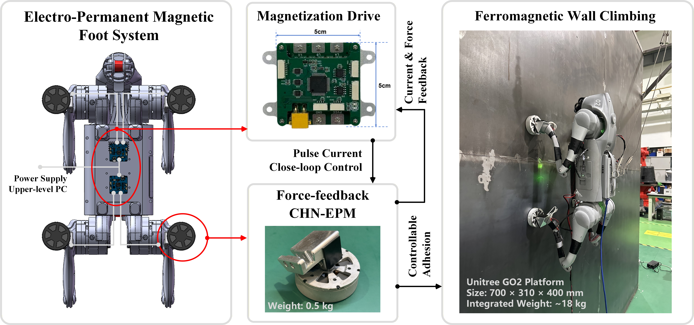

# Magnetic Quadruped Climbing Robot

> A high-force-density magnetic foot with closed-loop magnetization and force-feedback control, **validated on a quadruped robot (Unitree GO2)** for wall-climbing applications.

---

## 🔥 Highlights

- Electro-permanent magnetic (EPM) foot
- Closed-loop magnetization control
- Force-feedback-based contact sensing
- Robust adhesion under varying air gaps
- **Integrated and experimentally validated on Unitree GO2 quadruped robot**

---

## 🤖 Real Robot Integration (GO2)

The proposed magnetic foot system has been successfully integrated into a **Unitree GO2 quadruped robot**, enabling:

- Vertical wall climbing on steel surfaces  
- Stable adhesion during locomotion  
- Ceiling attachment capability (high load)  
- Real-world validation beyond lab-scale prototypes  

---

## 🧩 System Overview

---

## 🎥 Supplementary Movies

The videos are arranged in a logical validation sequence, from magnetic-foot load capacity to whole-body climbing demonstrations and more challenging configurations. Animated GIF previews are embedded for quick viewing, with the full MP4 videos linked below each preview.

### Movie S0 - Adhesion and load validation

System-level validation of the quadruped wall-climbing robot with the proposed CHN-EPM magnetic feet, including the single-foot adhesion test with a 100-kg load, whole-body adhesion on a ceiling with a 20-kg external load, and whole-body adhesion on a vertical wall with an 8-kg external load.

  

[Watch full MP4](./videos/Movie%20S0%20-%20Adhesion%20and%20load%20validation.mp4)

### Movie S1 - Single magnetic foot suspending people

Single CHN-EPM magnetic foot load demonstration by suspending people with body weights of 54 kg, 60 kg, and 90 kg.

  

[Watch full MP4](./videos/Movie%20S1%20-%20Single%20magnetic%20foot%20suspending%20people.mp4)

### Movie S2 - Vertical climbing on painted steel

Vertical climbing demonstration on a painted steel wall, showing stable locomotion with the integrated magnetic feet.

  

[Watch full MP4](./videos/Movie%20S2%20-%20Vertical%20climbing%20on%20painted%20steel.mp4)

### Movie S3 - Vertical climbing with partial contact

Vertical climbing on a perforated steel plate under partial-contact conditions, validating adhesion robustness when the magnetic feet cannot fully contact the surface.

  

[Watch full MP4](./videos/Movie%20S3%20-%20Vertical%20climbing%20with%20partial%20contact.mp4)

### Movie S4 - Curved-surface climbing

Vertical climbing on a curved ferromagnetic surface, demonstrating adaptability to non-planar steel structures.

  

[Watch full MP4](./videos/Movie%20S4%20-%20Curved-surface%20climbing.mp4)

### Movie S5 - Inverted 135-degree climbing

Inverted 135-degree wall-climbing demonstration, showing the robot operating on a more challenging overhanging ferromagnetic surface.

  

[Watch full MP4](./videos/Movie%20S5%20-%20Inverted%20135-degree%20climbing.mp4)

### Movie S6 - Wall transition climbing

Wall transition climbing demonstration, showing the robot moving from a curved surface onto a vertical ferromagnetic wall.

  

[Watch full MP4](./videos/Movie%20S6%20-%20Wall%20transition%20climbing.mp4)

---

## 📂 Repository Structure

- `hardware/` – Magnetic foot design & electronics  
- `software/` – Control algorithms  
- `experiments/` – Experimental validation  
- `datasets/` – Force / current / voltage data  
- `videos/` – Demonstration videos  
- `videos/gifs/` – Optimized GIF previews for README display

---

## 📄 Paper

**High-Load-Density Electro-Permanent Magnetic Foot with Controllable Adhesion for Quadruped Wall-Climbing Robots**  
An Li, Bo Tao, I-Ming Chen and Han Ding

[arXiv Preprint: https://doi.org/10.48550/arXiv.2605.30849 ](https://doi.org/10.48550/arXiv.2605.30849) 

---
## 👥 Project Team

**Collaborating Institutions:** Huazhong University of Science and Technology (HUST) and Nanyang Technological University (NTU)

**Academic Advisors / Principal Investigators:** Prof. Bo Tao (HUST), Prof. I-Ming Chen (NTU), and Prof. Han Ding (HUST)

**Technical Lead / Repository Maintainer:** Dr. An Li, Research Fellow, Nanyang Technological University (NTU)  
**Contact:** [an.li@ntu.edu.sg](mailto:an.li@ntu.edu.sg)

**Core Contributors:** Sucan Zhang, Tihong Fang, Xiangzhen Chen, Kaijie Zhang, Donghao Guo, Enlei Peng, Siliang Li, Qijie Zhuang, Jinxin Cui and Sirui Chen.

**Acknowledgements:** We gratefully acknowledge Zeyu Gong, Xingwei Zhao, Qinmiao Zhu, Yuhao Zhang and Quanliang Cao for their valuable guidance and support during the development of this project.

---
