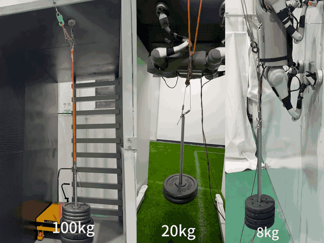
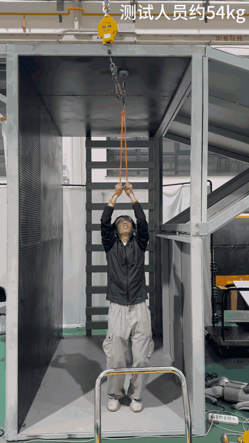
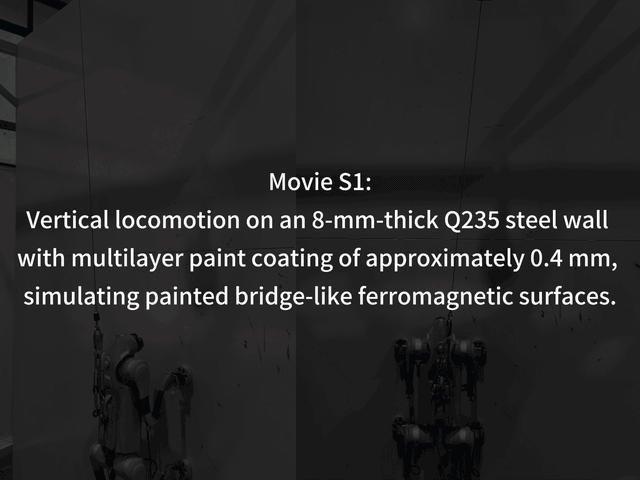
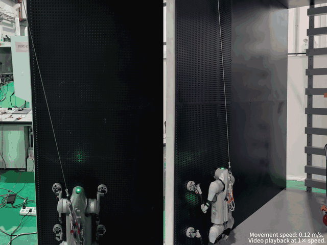
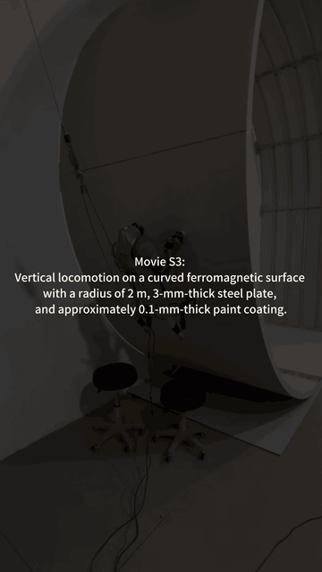
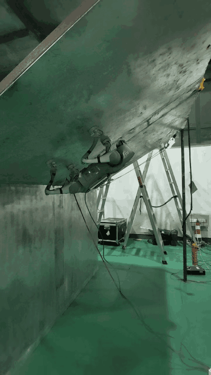

# Magnetic Quadruped Climbing Robot

> A high-force-density magnetic foot with closed-loop magnetization and force-feedback control, **validated on a quadruped robot (Unitree GO2)** for wall-climbing applications.

---

## 🔥 Highlights

- Electro-permanent magnetic (EPM) foot
- Closed-loop magnetization control
- Force-feedback-based contact sensing
- Robust adhesion under varying air gaps
- **Integrated and experimentally validated on Unitree GO2 quadruped robot**

---

## 🤖 Real Robot Integration (GO2)

The proposed magnetic foot system has been successfully integrated into a **Unitree GO2 quadruped robot**, enabling:

- Vertical wall climbing on steel surfaces  
- Stable adhesion during locomotion  
- Ceiling attachment capability (high load)  
- Real-world validation beyond lab-scale prototypes  

---

## 🧩 System Overview

---

## 🎥 Supplementary Movies

The videos are arranged in a logical validation sequence, from magnetic-foot load capacity to whole-body climbing demonstrations and more challenging configurations. Animated GIF previews are embedded for quick viewing, with the full MP4 videos linked below each preview.

### Movie S0 - Adhesion and load validation

System-level validation of the quadruped wall-climbing robot with the proposed CHN-EPM magnetic feet, including the single-foot adhesion test with a 100-kg load, whole-body adhesion on a ceiling with a 20-kg external load, and whole-body adhesion on a vertical wall with an 8-kg external load.

  

### Movie S1 - Single magnetic foot suspending people

Single CHN-EPM magnetic foot load demonstration by suspending people with body weights of 54 kg, 60 kg, and 90 kg.

  

### Movie S2 - Vertical climbing on painted steel

Vertical climbing demonstration on a painted steel wall, showing stable locomotion with the integrated magnetic feet.

  

### Movie S3 - Vertical climbing with partial contact

Vertical climbing on a perforated steel plate under partial-contact conditions, validating adhesion robustness when the magnetic feet cannot fully contact the surface.

  

### Movie S4 - Curved-surface climbing

Vertical climbing on a curved ferromagnetic surface, demonstrating adaptability to non-planar steel structures.

  

### Movie S5 - Inverted 135-degree climbing

Inverted 135-degree wall-climbing demonstration, showing the robot operating on a more challenging overhanging ferromagnetic surface.

  

---

## 📂 Repository Structure

- `hardware/` – Magnetic foot design & electronics  
- `software/` – Control algorithms  
- `experiments/` – Experimental validation  
- `datasets/` – Force / current / voltage data  
- `videos/` – Demonstration videos  
- `videos/gifs/` – Optimized GIF previews for README display

---
